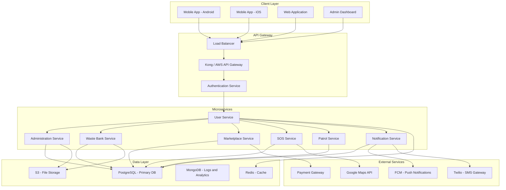
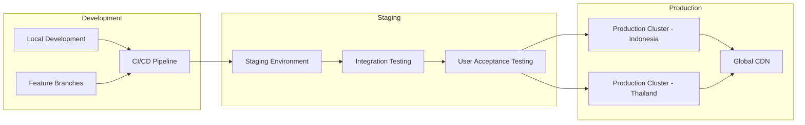

# Digital RT-Muban Technical Architecture

## Toyota Foundation IGP 2026 Project

**Project Title:** Digital RT-Muban: Smart Neighborhood Management for Circular and Caring Communities

**Version:** 1.0  
**Date:** May 2026  
**Countries:** Indonesia and Thailand

---

## 1. Executive Summary

This document outlines the technical architecture for a multilingual digital platform that integrates five core functions for neighborhood governance: Administration, Waste Banking, Marketplace, SOS Emergency Alerts, and Patrol Scheduling. The platform is designed to serve RT in Indonesia and Muban in Thailand.

---

## 2. System Overview

### 2.1 Core Features

| Feature | Description |
|---------|-------------|
| Administration | Resident management, household records, document management, announcements |
| Waste Banking | Waste collection scheduling, recycling points, environmental tracking |
| Marketplace | Local business directory, product listings, community transactions |
| SOS | Emergency alerts, emergency contacts, incident reporting |
| Patrol Scheduling | Security patrol management, shift scheduling, incident logging |

### 2.2 Target Users

- **RT/Muban Leaders** - Administrators with full management capabilities
- **Residents** - Community members accessing services and information
- **Local Businesses** - Entrepreneurs listing products and services
- **Security Personnel** - Patrol team members with scheduling access
- **Waste Collectors** - Collection teams managing waste bank operations

---

## 3. System Architecture

### 3.1 High-Level Architecture

### 3.2 Technology Stack

#### Backend Services
- **Framework**: Node.js with Express.js (TypeScript)
- **API Gateway**: Kong or AWS API Gateway
- **Authentication**: JWT with OAuth2, Passport.js
- **Message Queue**: RabbitMQ for async processing
- **Real-time**: Socket.io for SOS alerts and notifications

#### Database Layer
- **Primary Database**: PostgreSQL 16+ with PostGIS for location data
- **Caching**: Redis for session management and frequent queries
- **Analytics**: MongoDB for logs, analytics, and unstructured data
- **File Storage**: AWS S3 or MinIO for document and image storage

#### Frontend Applications
- **Mobile Apps**: React Native (cross-platform for Android/iOS)
- **Web Application**: React 18+ with TypeScript, Next.js for SSR
- **Admin Dashboard**: React with Material-UI or Ant Design
- **State Management**: Redux Toolkit with RTK Query

#### DevOps and Infrastructure
- **Containerization**: Docker with Docker Compose
- **Orchestration**: Kubernetes (EKS/GKE) or Docker Swarm
- **CI/CD**: GitHub Actions or GitLab CI
- **Monitoring**: Prometheus + Grafana, ELK Stack for logs
- **Cloud Provider**: AWS or Google Cloud Platform

#### External Integrations
- **Maps**: Google Maps API / OpenStreetMap
- **SMS**: Twilio or local providers (Telkomsel, AIS)
- **Push Notifications**: Firebase Cloud Messaging (FCM)
- **Payment**: Midtrans (Indonesia), Omise (Thailand)
- **Translation**: Google Translate API for dynamic content

### 3.3 Deployment Architecture

