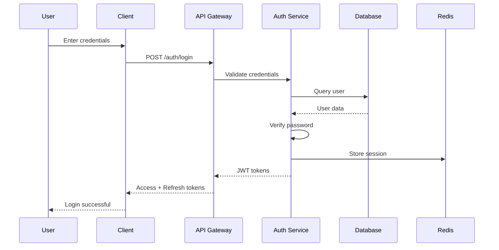
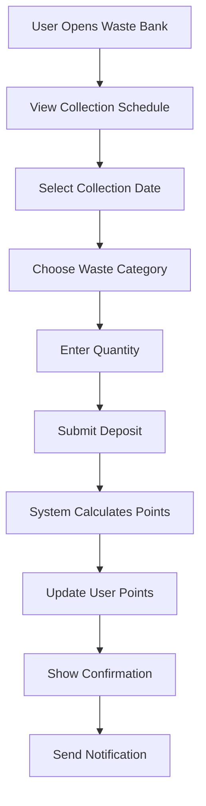
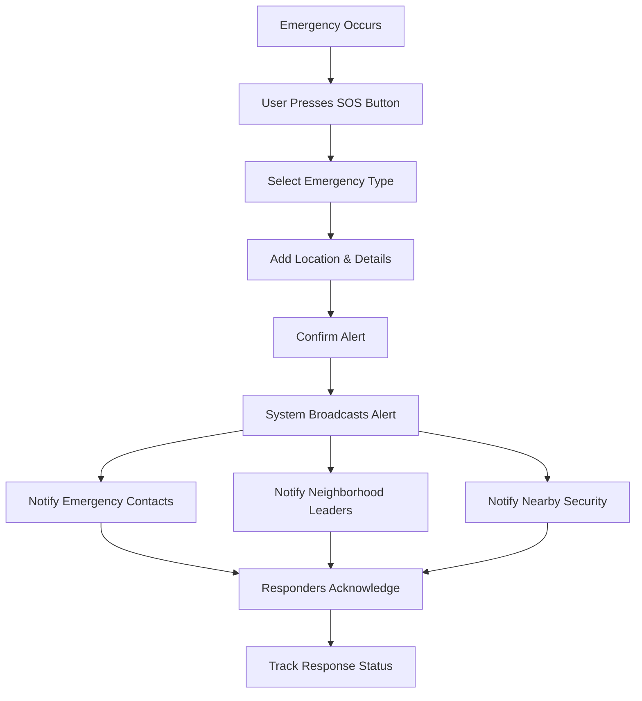
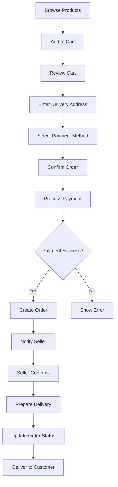
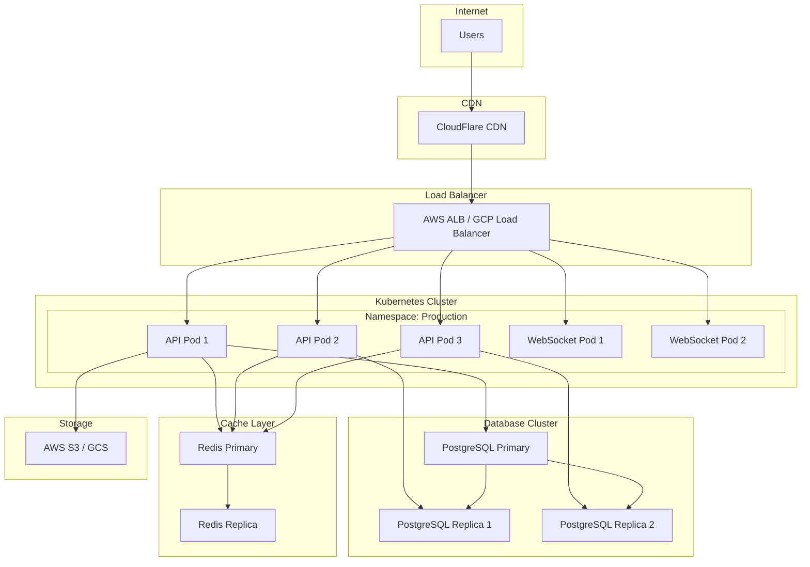
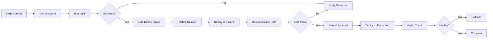

# Digital RT-Muban Implementation Plan

## Toyota Foundation IGP 2026 Project

**Version:** 1.0  
**Date:** May 2026  
**Project Duration:** 24 months (November 2026 - October 2028)

---

## 1. Security & Authentication Design

### 1.1 Authentication Flow



### 1.2 Security Measures

#### Password Security
- **Hashing**: bcrypt with salt rounds of 12
- **Password Policy**: Minimum 8 characters, mix of letters, numbers, symbols
- **Password Reset**: Time-limited tokens (15 minutes expiry)
- **Account Lockout**: 5 failed attempts = 30-minute lockout

#### Token Management
- **Access Token**: JWT, 15-minute expiry
- **Refresh Token**: JWT, 7-day expiry
- **Token Storage**: Redis for session management
- **Token Rotation**: New refresh token on each use

#### API Security
- **Rate Limiting**: 100 requests per minute per user
- **CORS**: Whitelist specific domains
- **Input Validation**: Joi/Yup schema validation
- **SQL Injection Prevention**: Parameterized queries
- **XSS Protection**: Content Security Policy headers

#### Data Encryption
- **In Transit**: TLS 1.3 for all communications
- **At Rest**: AES-256 encryption for sensitive data
- **Database**: PostgreSQL Transparent Data Encryption
- **File Storage**: S3 server-side encryption

### 1.3 Role-Based Access Control (RBAC)

| Role | Permissions |
|------|-------------|
| **Admin** | Full system access, user management, system configuration |
| **RT/Muban Leader** | Neighborhood management, announcements, approve businesses |
| **Resident** | View announcements, waste deposits, marketplace orders, SOS alerts |
| **Business Owner** | Manage business profile, products, orders |
| **Security Personnel** | Patrol management, incident reporting |
| **Waste Collector** | Waste collection management, transaction recording |

### 1.4 Privacy & Compliance

- **GDPR Compliance**: Right to access, rectify, delete personal data
- **Data Localization**: Indonesia and Thailand data stored in respective regions
- **Consent Management**: Explicit consent for data collection
- **Data Retention**: Automatic deletion after 7 years
- **Audit Logging**: All data access and modifications logged

---

## 2. Multilingual Support Strategy

### 2.1 Supported Languages

| Language | Code | Primary Users |
|----------|------|---------------|
| Indonesian | id | Indonesia RT communities |
| Thai | th | Thailand Muban communities |
| English | en | International users, fallback |

### 2.2 Implementation Approach

#### Frontend Localization
```javascript
// Using react-i18next
import i18n from 'i18next';
import { initReactI18next } from 'react-i18next';

i18n
  .use(initReactI18next)
  .init({
    resources: {
      id: { translation: require('./locales/id.json') },
      th: { translation: require('./locales/th.json') },
      en: { translation: require('./locales/en.json') }
    },
    lng: 'id',
    fallbackLng: 'en',
    interpolation: { escapeValue: false }
  });
```

#### Backend Localization
```javascript
// Using i18next for Node.js
const i18next = require('i18next');
const Backend = require('i18next-fs-backend');

i18next
  .use(Backend)
  .init({
    backend: {
      loadPath: './locales/{{lng}}/{{ns}}.json'
    },
    fallbackLng: 'en',
    preload: ['id', 'th', 'en']
  });
```

### 2.3 Translation Files Structure

```
/locales
  /id
    - common.json
    - auth.json
    - waste-bank.json
    - marketplace.json
    - sos.json
    - patrol.json
  /th
    - common.json
    - auth.json
    - waste-bank.json
    - marketplace.json
    - sos.json
    - patrol.json
  /en
    - common.json
    - auth.json
    - waste-bank.json
    - marketplace.json
    - sos.json
    - patrol.json
```

### 2.4 Localization Considerations

#### Date & Time Formatting
- **Indonesia**: DD/MM/YYYY, 24-hour format
- **Thailand**: DD/MM/YYYY (Buddhist calendar), 24-hour format
- **Library**: date-fns with locale support

#### Currency Formatting
- **Indonesia**: IDR (Rp 15.000)
- **Thailand**: THB (฿ 500)
- **Library**: Intl.NumberFormat

#### Number Formatting
- **Indonesia**: Decimal comma (1.000,50)
- **Thailand**: Decimal point (1,000.50)

#### Cultural Adaptations
- **Color Meanings**: Different cultural significance
- **Icons**: Culturally appropriate symbols
- **Images**: Localized imagery
- **Content**: Culturally sensitive messaging

---

## 3. Component Architecture & System Flow

### 3.1 Frontend Component Structure

```
/src
  /components
    /common
      - Button
      - Input
      - Modal
      - Card
      - Navbar
    /auth
      - LoginForm
      - RegisterForm
      - PasswordReset
    /administration
      - AnnouncementList
      - HouseholdManager
      - ResidentProfile
    /waste-bank
      - DepositForm
      - PointsDisplay
      - CollectionSchedule
    /marketplace
      - BusinessCard
      - ProductList
      - OrderForm
    /sos
      - AlertButton
      - EmergencyContacts
      - IncidentReport
    /patrol
      - ShiftCalendar
      - PatrolLog
      - IncidentForm
  /pages
  /services
  /hooks
  /utils
  /locales
```

### 3.2 User Journey Flows

#### Waste Deposit Flow


#### SOS Alert Flow


#### Marketplace Order Flow


### 3.3 Real-Time Communication

#### WebSocket Events
```javascript
// SOS Alert Broadcasting
socket.on('sos:alert', (data) => {
  // Broadcast to neighborhood members
  io.to(`neighborhood:${data.neighborhood_id}`).emit('sos:new_alert', data);
  
  // Notify emergency contacts
  notifyEmergencyContacts(data.user_id, data);
  
  // Notify security personnel
  notifySecurityTeam(data.neighborhood_id, data);
});

// Patrol Status Updates
socket.on('patrol:status_update', (data) => {
  io.to(`patrol:${data.shift_id}`).emit('patrol:status_changed', data);
});

// Order Status Updates
socket.on('order:status_update', (data) => {
  io.to(`user:${data.buyer_id}`).emit('order:status_changed', data);
  io.to(`user:${data.seller_id}`).emit('order:status_changed', data);
});
```

---

## 4. Deployment & Infrastructure Plan

### 4.1 Infrastructure Architecture



### 4.2 Deployment Environments

| Environment | Purpose | Infrastructure |
|-------------|---------|----------------|
| **Development** | Local development | Docker Compose |
| **Staging** | Testing & UAT | Single Kubernetes cluster |
| **Production - Indonesia** | Live RT communities | Multi-zone Kubernetes cluster |
| **Production - Thailand** | Live Muban communities | Multi-zone Kubernetes cluster |

### 4.3 CI/CD Pipeline



### 4.4 Monitoring & Alerting

#### Metrics to Monitor
- **Application**: Response time, error rate, throughput
- **Infrastructure**: CPU, memory, disk usage
- **Database**: Query performance, connection pool
- **Cache**: Hit rate, memory usage
- **Business**: Active users, transactions, alerts

#### Monitoring Stack
- **Metrics**: Prometheus + Grafana
- **Logs**: ELK Stack (Elasticsearch, Logstash, Kibana)
- **APM**: New Relic or Datadog
- **Uptime**: UptimeRobot or Pingdom
- **Alerts**: PagerDuty for critical issues

### 4.5 Backup & Disaster Recovery

#### Backup Strategy
- **Database**: Daily full backup, hourly incremental
- **Files**: Continuous replication to S3
- **Retention**: 30 days for daily, 1 year for monthly
- **Testing**: Monthly restore tests

#### Disaster Recovery
- **RTO (Recovery Time Objective)**: 4 hours
- **RPO (Recovery Point Objective)**: 1 hour
- **Failover**: Automated failover to replica
- **Geographic Redundancy**: Multi-region deployment

---

## 5. Implementation Roadmap

### Phase 1: Foundation (Months 1-3)

#### Month 1: Project Setup
- [ ] Set up development environment
- [ ] Configure version control and CI/CD
- [ ] Set up cloud infrastructure
- [ ] Initialize database schema
- [ ] Create base authentication system

#### Month 2: Core Infrastructure
- [ ] Implement API gateway
- [ ] Set up microservices architecture
- [ ] Configure Redis caching
- [ ] Implement logging and monitoring
- [ ] Create admin dashboard foundation

#### Month 3: User Management
- [ ] Complete authentication flows
- [ ] Implement RBAC system
- [ ] Build user profile management
- [ ] Create neighborhood management
- [ ] Develop household registration

**Deliverables:**
- Working authentication system
- Basic admin dashboard
- User and neighborhood management

---

### Phase 2: Core Features (Months 4-6)

#### Month 4: Waste Banking System
- [ ] Implement waste category management
- [ ] Build collection scheduling
- [ ] Create deposit recording system
- [ ] Develop points calculation engine
- [ ] Build recycling center directory

#### Month 5: Marketplace System
- [ ] Implement business registration
- [ ] Build product management
- [ ] Create shopping cart functionality
- [ ] Integrate payment gateway
- [ ] Develop order management

#### Month 6: SOS & Patrol Systems
- [ ] Build SOS alert system
- [ ] Implement emergency contact management
- [ ] Create patrol scheduling
- [ ] Develop incident reporting
- [ ] Build real-time notification system

**Deliverables:**
- Functional waste banking module
- Working marketplace with payments
- SOS and patrol management systems

---

### Phase 3: Integration & Localization (Months 7-9)

#### Month 7: System Integration
- [ ] Integrate all five core modules
- [ ] Implement cross-module workflows
- [ ] Build unified dashboard
- [ ] Create comprehensive search
- [ ] Develop analytics and reporting

#### Month 8: Multilingual Support
- [ ] Implement i18n framework
- [ ] Create translation files (ID, TH, EN)
- [ ] Localize all UI components
- [ ] Adapt cultural elements
- [ ] Test language switching

#### Month 9: Mobile Applications
- [ ] Develop React Native mobile app
- [ ] Implement offline capabilities
- [ ] Optimize for mobile performance
- [ ] Add push notifications
- [ ] Conduct mobile testing

**Deliverables:**
- Fully integrated platform
- Multilingual support (ID, TH, EN)
- Mobile applications (Android & iOS)

---

### Phase 4: Pilot Deployment (Months 10-12)

#### Month 10: Pilot Preparation
- [ ] Select pilot RT in Indonesia
- [ ] Select pilot Muban in Thailand
- [ ] Conduct user training sessions
- [ ] Prepare documentation
- [ ] Set up support channels

#### Month 11: Pilot Launch
- [ ] Deploy to pilot sites
- [ ] Onboard initial users
- [ ] Monitor system performance
- [ ] Gather user feedback
- [ ] Provide ongoing support

#### Month 12: Evaluation & Iteration
- [ ] Analyze usage data
- [ ] Conduct user surveys
- [ ] Identify improvement areas
- [ ] Implement critical fixes
- [ ] Prepare scale-up plan

**Deliverables:**
- Pilot deployment in both countries
- User feedback and evaluation report
- Refined platform based on feedback

---

### Phase 5: Scaling & Enhancement (Months 13-24)

#### Months 13-18: Expansion
- [ ] Scale to additional RT/Muban
- [ ] Optimize infrastructure
- [ ] Enhance features based on feedback
- [ ] Develop advanced analytics
- [ ] Build community toolkit

#### Months 19-24: Sustainability
- [ ] Knowledge transfer to communities
- [ ] Create training materials
- [ ] Develop policy briefs
- [ ] Publish academic papers
- [ ] Plan for long-term maintenance

**Deliverables:**
- Scaled platform across multiple communities
- Comprehensive documentation and toolkit
- Academic and policy outputs
- Sustainability plan

---

## 6. Resource Requirements

### 6.1 Development Team

| Role | Quantity | Responsibilities |
|------|----------|------------------|
| **Project Manager** | 1 | Overall coordination, stakeholder management |
| **Backend Developers** | 3 | API development, microservices, database |
| **Frontend Developers** | 2 | Web and mobile app development |
| **UI/UX Designer** | 1 | Interface design, user experience |
| **DevOps Engineer** | 1 | Infrastructure, deployment, monitoring |
| **QA Engineer** | 1 | Testing, quality assurance |
| **Community Liaison** | 2 | User training, support (1 per country) |

### 6.2 Infrastructure Costs (Monthly Estimates)

| Service | Cost (USD) |
|---------|------------|
| Cloud Hosting (AWS/GCP) | $500 |
| Database (PostgreSQL) | $200 |
| Cache (Redis) | $100 |
| File Storage (S3) | $50 |
| CDN (CloudFlare) | $100 |
| Monitoring (New Relic) | $150 |
| SMS Gateway (Twilio) | $100 |
| Payment Gateway Fees | Variable |
| **Total** | **~$1,200/month** |

### 6.3 Third-Party Services

- **Maps**: Google Maps API or OpenStreetMap
- **SMS**: Twilio or local providers
- **Push Notifications**: Firebase Cloud Messaging (Free)
- **Payment**: Midtrans (Indonesia), Omise (Thailand)
- **Translation**: Google Translate API (optional)

---

## 7. Risk Management

### 7.1 Technical Risks

| Risk | Impact | Mitigation |
|------|--------|------------|
| **Scalability issues** | High | Load testing, horizontal scaling, caching |
| **Data loss** | Critical | Regular backups, replication, disaster recovery |
| **Security breaches** | Critical | Security audits, penetration testing, encryption |
| **API performance** | Medium | Query optimization, caching, CDN |
| **Third-party service outages** | Medium | Fallback mechanisms, service redundancy |

### 7.2 Operational Risks

| Risk | Impact | Mitigation |
|------|--------|------------|
| **Low user adoption** | High | User training, community engagement, incentives |
| **Internet connectivity issues** | Medium | Offline-first design, data synchronization |
| **Language barriers** | Medium | Comprehensive localization, visual aids |
| **Cultural resistance** | Medium | Community involvement, gradual rollout |

### 7.3 Project Risks

| Risk | Impact | Mitigation |
|------|--------|------------|
| **Timeline delays** | Medium | Agile methodology, regular sprints, buffer time |
| **Budget overruns** | Medium | Cost monitoring, open-source tools, cloud optimization |
| **Team turnover** | Medium | Documentation, knowledge sharing, backup resources |
| **Scope creep** | Medium | Clear requirements, change management process |

---

## 8. Success Metrics

### 8.1 Technical Metrics

- **System Uptime**: > 99.5%
- **API Response Time**: < 200ms (95th percentile)
- **Error Rate**: < 0.1%
- **Page Load Time**: < 3 seconds
- **Mobile App Crash Rate**: < 1%

### 8.2 User Engagement Metrics

- **Daily Active Users (DAU)**: Track growth over time
- **Monthly Active Users (MAU)**: Target 80% of registered users
- **Feature Adoption Rate**: > 60% for each core feature
- **User Retention**: > 70% after 3 months
- **Session Duration**: Average 5+ minutes

### 8.3 Business Impact Metrics

- **Waste Recycling Volume**: Measure increase from baseline
- **Emergency Response Time**: Measure reduction from baseline
- **Local Business Transactions**: Track marketplace activity
- **Community Participation**: Measure engagement in activities
- **User Satisfaction (NPS)**: Target score > 50

---

## 9. Quality Assurance Strategy

### 9.1 Testing Approach

#### Unit Testing
- **Coverage Target**: > 80%
- **Tools**: Jest (JavaScript), pytest (Python)
- **Scope**: Individual functions and components

#### Integration Testing
- **Tools**: Supertest, Postman
- **Scope**: API endpoints, service interactions

#### End-to-End Testing
- **Tools**: Cypress, Selenium
- **Scope**: Complete user workflows

#### Performance Testing
- **Tools**: Apache JMeter, k6
- **Scope**: Load testing, stress testing

#### Security Testing
- **Tools**: OWASP ZAP, Burp Suite
- **Scope**: Vulnerability scanning, penetration testing

### 9.2 Code Quality

- **Code Reviews**: Mandatory for all pull requests
- **Linting**: ESLint, Prettier for code formatting
- **Static Analysis**: SonarQube for code quality
- **Documentation**: JSDoc, Swagger for API docs

---

## 10. Documentation Deliverables

### 10.1 Technical Documentation

- [ ] System architecture document
- [ ] Database schema documentation
- [ ] API documentation (Swagger/OpenAPI)
- [ ] Deployment guide
- [ ] Security guidelines

### 10.2 User Documentation

- [ ] User manual (ID, TH, EN)
- [ ] Admin guide
- [ ] Video tutorials
- [ ] FAQ document
- [ ] Troubleshooting guide

### 10.3 Training Materials

- [ ] Community leader training modules
- [ ] Resident onboarding materials
- [ ] Business owner guide
- [ ] Security personnel handbook
- [ ] Waste collector training

### 10.4 Research Outputs

- [ ] Comparative analysis report (RT vs Muban)
- [ ] Pilot implementation report
- [ ] Policy briefs for stakeholders
- [ ] Academic paper for publication
- [ ] Open-source toolkit for adaptation

---

**Document Version**: 1.0  
**Last Updated**: May 2026  
**Next Review**: August 2026
